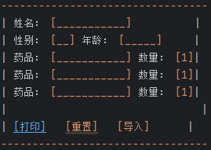
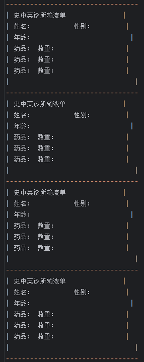
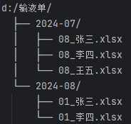

# 软件需求方案

## 功能概述

### 用户填写输液单：

- 输入患者姓名、性别、年龄、药品及其数量（默认数量为1）。
- 药品输入框具有联想功能，帮助快速选择药品。
- 提供“打印”、“重置”和“导入”按钮。

### 打印功能：

- 生成并打印标题为“史中英诊所输液单”的表单。
- 每个输液单包含四个相同部分，填满A5纸张。
- 打印时将输液单存储为Excel文件，文件路径为：`d:/输液单/yyyy-mm/yymmdd_姓名.xlsx`。

### 重置功能：

- 清空所有输入内容。

### 导入功能：

- 手动选择Excel文件（`d:/输液单/yyyy-mm/yymmdd_姓名.xlsx`），将文件内容导入到界面输入部分。

## 用户界面设计

### 输入界面

<!-- ---------------------------------
| 姓名： [___________]          |
| 性别： [__] 年龄： [_____]     |
| 药品： [___________] 数量： [1]|
| 药品： [___________] 数量： [1]|
| 药品： [___________] 数量： [1]|
|                               |
| [打印]   [重置]   [导入]      |
--------------------------------- -->

### 功能按钮

- **打印**：打印输液单并存储为Excel文件。
- **重置**：清空所有输入内容。
- **导入**：选择并导入Excel文件内容。

## 打印布局设计

<!-----------------------------------
| 史中英诊所输液单              |
| 姓名：          性别：        |
| 年龄：                        |
| 药品： 数量：                 |
| 药品： 数量：                 |
| 药品： 数量：                 |
|                               |
---------------------------------
| 史中英诊所输液单              |
| 姓名：          性别：        |
| 年龄：                        |
| 药品： 数量：                 |
| 药品： 数量：                 |
| 药品： 数量：                 |
|                               |
---------------------------------
| 史中英诊所输液单              |
| 姓名：          性别：        |
| 年龄：                        |
| 药品： 数量：                 |
| 药品： 数量：                 |
| 药品： 数量：                 |
|                               |
---------------------------------
| 史中英诊所输液单              |
| 姓名：          性别：        |
| 年龄：                        |
| 药品： 数量：                 |
| 药品： 数量：                 |
| 药品： 数量：                 |
|                               |
--------------------------------- -->
## 存储路径示意图

<!-- d:/输液单/
  ├── 2024-07/
  │   ├── 240708_张三.xlsx
  │   ├── 240708_李四.xlsx
  │   └── 240708_王五.xlsx
  └── 2024-08/
      ├── 240801_张三.xlsx
      └── 240801_李四.xlsx -->
## 功能流程

### 填写信息：

- 输入姓名、性别、年龄和药品信息及数量。
- 点击“打印”按钮，打印并存储输液单。
- 点击“重置”按钮，清空所有输入内容。
- 点击“导入”按钮，选择并导入Excel文件内容。

### 打印流程：

- 系统连接打印机，生成A5纸的输液单。
- 存储为Excel文件，路径为：`d:/输液单/yyyy-mm/yymmdd_姓名.xlsx`。

### 重置流程：

- 清空所有输入内容。

### 导入流程：

- 选择Excel文件，将内容导入输入区域。